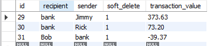
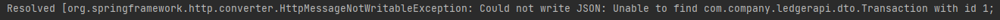
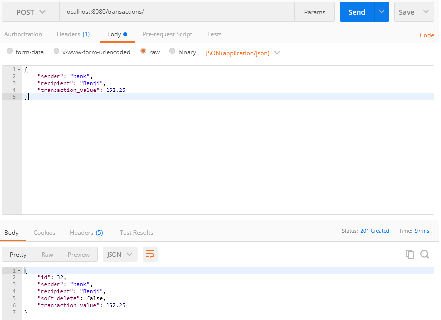
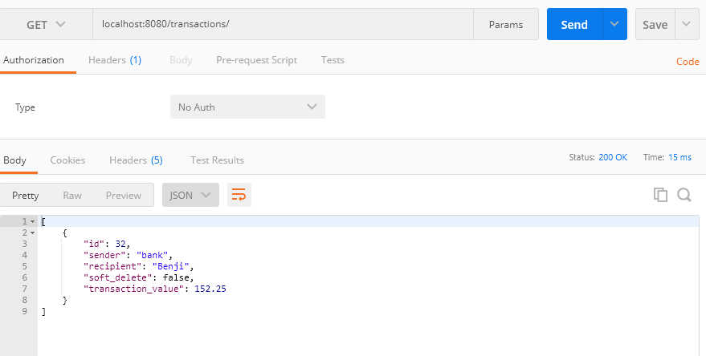
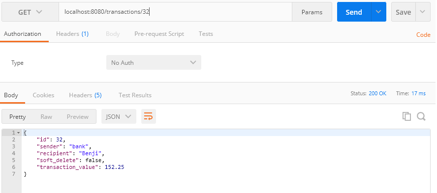
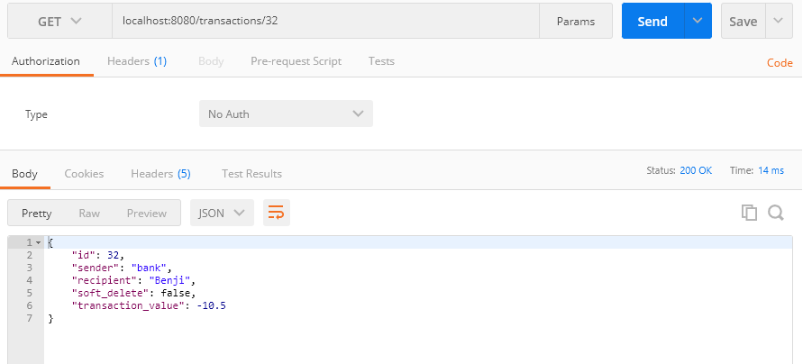
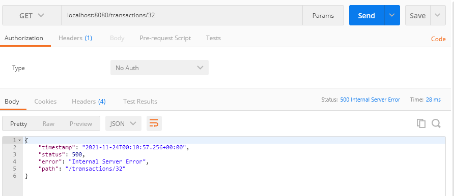
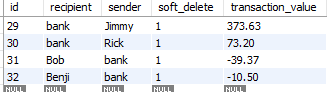
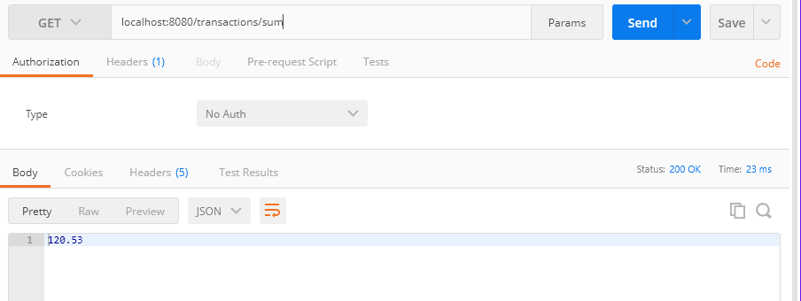

# 1.1 Lesson Plan: Spring Data JPA

## Introduction (5 mins)

### Session Overview 

In this lesson, we will be learning Spring Data JPA. Spring Data JPA makes it exceptionally easy to set up and model databases right in our Java code. This allows us to cut down on boilerplate and confusing setup and get to writing code!

This lesson assumes a foundational knowledge of the following topics:
- Intro to programming and Java fundamentals
- Basics of object-oriented programming
- Data structures, collections, and exception handling
- SQL, Joins and normalization
- Understanding of Restful APIs
- Spring MVC 

### Timetracker

|Section|Topic|Duration|Time Elapsed|
|--|--|--|--|
||Introduction|5 mins|5 mins|
|1.1|Initialize Project|5 mins|10 mins|
|1.2|Transaction Class & Annotations|15 mins|25 mins|
|1.3|Implementing Soft Delete Functionality|10 mins|35 mins|
|1.4|Configuring Database|10 mins|45 mins|
|1.5|Repository|10 mins|55 mins|
|| Break|10 mins|65 mins|
|2.1|Test DAO|10 mins|75 mins|
|2.2|Get All Transactions|10 mins|85 mins|
|2.3|Get a Specific Transaction|15 mins|100 mins|
|2.4|Review: Get a Specific Transaction|5 mins|105 mins|
|2.5|Create a Transaction|10 mins|115 mins|
|2.6|Partially Alter a Transaction|15 mins|130 mins|
||Break|10 mins|140 mins|
|2.7|Delete a Transaction|15 mins|155 mins|
|2.8|Review: Delete a Transaction|5 mins|160 mins|
|2.9|Sum All Transactions|15 mins|175 mins|
||Recap|5 mins| 180 mins|


### Learning Outcomes 

By the end of this lesson, learners should be able to:
- Create a schema based on a DTO with Spring Data JPA annotations
- Implement a soft-delete pattern with Spring Data JPA
- Use included Query methods from the JpaRepository interface
- Achieve basic CRUD functionality with Spring Data JPA and MySql

## 1. Spring Data JPA: Setup

### 1.1 We Do: Initialize Project (5 mins)

To demonstrate a simple CRUD service using Spring Data JPA, we are going to be creating a simple ledger API. This ledger API will consist of just one table that will allow us to track transaction data.

To start off the project we will first have to intialize a project using [Spring Initializr](https://start.spring.io/).

Have the students create the ledger API project by following these instructions:

1. Navigate to https://start.spring.io/

2. Create a new project with the following settings (anything not specified below should be left at the 
default value):

  * Project Metadata - Group: com.company
  * Project Metadata - Artifact: ledger-api
  * Dependencies: Web, MySql Driver, Spring Data JPA
  * Be sure to select Java 8 instead of the default Java 11

3. Click the Generate button.
4. Unzip the project and open it in IntelliJ.
5. Open the pom.xml file.
6. Add the following dependency in the `<dependencies> </dependencies>` section of the pom.xml file:

    ```
    <dependency>
        <groupId>junit</groupId>
        <artifactId>junit</artifactId>
        <scope>test</scope>
    </dependency>   
    ```

### 1.2 We Do: Transaction Class & Annotations (15 mins)

For this section, we will live code the `Transaction` class. Learners should already know about the concept of DTOs, but in this section we are going to stress the Spring Data JPA annotations that map our DTOs to a database schema.

We want the DTO that we create to map to the following schema:

```sql
CREATE TABLE `transaction` (
  `id` int NOT NULL,
  `recipient` varchar(255) NOT NULL,
  `sender` varchar(255) NOT NULL,
  `soft_delete` bit(1) NOT NULL,
  `transaction_value` decimal(19,2) NOT NULL,
  PRIMARY KEY (`id`)
)
```

Inside of `src.main.java.com.company.ledgerapi`, create a class called `dto.Transaction`.

Code the following class:

```Java
@Entity
@JsonIgnoreProperties({"hibernateLazyInitializer", "handler"})
@Table(name="transaction")
public class Transaction {

    @Id
    @GeneratedValue(strategy = GenerationType.AUTO)
    private Integer id;
    @NotNull
    private String sender;
    @NotNull
    private String recipient;
    private boolean soft_delete = Boolean.FALSE;
    @NotNull
    private BigDecimal transaction_value;

    //setters and getters not included. Be sure to generate these by right clicking on the class and hitting the Generate button in IntelliJ.
    //Be sure to also override equals and hashcode using the same generate button.
}
```

Talk about the following annotations:
- `@Entity` is applied at the class-level and denotes that this is a persistance object. An entity is analogous to table and means that this object will map to a table.
- `@JsonIgnoreProperties` is applied at the class-level and specifies properties to be ignored when serializing the object to JSON.
- `@Table` is applied at the class level and defines the name of the table. If this is left out, the table will use the class name instead.
- `@Id` is applied at the property-level and indicates that this property is the primary key for the table.
- `@GeneratedValue` is applied at the property-level and indicates that the value is generated. We are using `GenerationType.AUTO` to specify that this value should be auto generated.
- `@NotNull` is applied at the property level and specifies that the property cannot be `null`.

Additionally, talk about the following points:
- We will be implementing a soft delete functionality. For our `soft_delete` property, we want to set it to default to false, to do this we are using `=Boolean.FALSE`.
- We will be using `BigDecimal` as the type for `transaction_value` since we want the numbers to be accurate for a calculation we will perform later.

[Spring Data JPA Annotations](https://www.baeldung.com/spring-data-annotations)

[Big Decimal Docs](https://docs.oracle.com/javase/7/docs/api/java/math/BigDecimal.html)


### 1.3 We Do: Implementing Soft Delete Functionality (10 mins)

We want to implement a soft delete functionality. This essentially means that rather than deleting any rows from our database, we want to use a column to store a true or false value that will specify whether or not the row data will be visible or available to the user. For our purposes, if the value of `soft_delete` is `true` the data will no longer be visible to the user.

Implementing a soft delete with Spring Data JPA is extremely simple, we just need to make use of the two following annotations:
- `@SQLDelete` this annotation lets us override the delete command. We will use it to change our delete command to update our `soft_delete` value.
- `@Where` this annotation adds a filter when we read our table data. We will use this annotation to exclude values where `soft_delete` is true.

Add annotations to your `Transaction` class:

```java
@SQLDelete(sql = "UPDATE transaction SET soft_delete = true WHERE id=?")
@Where(clause = "soft_delete=false")
```
Your class should now look like this:

```Java
@Entity
@JsonIgnoreProperties({"hibernateLazyInitializer", "handler"})
@Table(name="transaction")
@SQLDelete(sql = "UPDATE transaction SET soft_delete = true WHERE id=?")
@Where(clause = "soft_delete=false")
public class Transaction {

    @Id
    @GeneratedValue(strategy = GenerationType.AUTO)
    private Integer id;
    @NotNull
    private String sender;
    @NotNull
    private String recipient;
    private boolean soft_delete = Boolean.FALSE;
    @NotNull
    private BigDecimal transaction_value;

    //setters and getters not included. Be sure to generate these by right clicking on the class and hitting the Generate button in IntelliJ.
    //Be sure to also override equals and hashcode using the same generate button.
}
```
Explain that now our delete commands will be overriden with an update command that sets `soft_delete` to true. Furthermore, only data with a value of `false` for `soft_delete` will be included in our results.

### 1.4 We Do: Configuring Database (10 mins)

Next, we will need to add some entries to our `resources/application.properties` file inside our `main` directory to configure our database connection.

Add the following to the `resources/application.properties` file:

```properties
spring.datasource.url=jdbc:mysql://localhost:3306/ledger_api?useSSL=false&serverTimezone=UTC&createDatabaseIfNotExist=true&allowPublicKeyRetrieval=true
spring.datasource.username=root
spring.datasource.password=rootroot

spring.jpa.hibernate.ddl-auto=update

spring.jpa.show-sql=true
```

Note the following:
- `createDatabasIfNotExist=true` added to our spring datasource url makes it so that we do not have to create the schema before running our application, if we did not have the piece, we would have to make sure that a database matching the name in the url existed. In this case we would have to make sure that `ledger_api` existed.
- `spring.datasource.username` and `spring.datasource.password` will need to be configured to the password set for your MySQL connection. It is recommened to use something like `root` and `rootroot` so that students do not expose any personal passwords in this file.
- `spring.jpa.hibernate.ddl-auto` gives an instruction for how to initialize the schema. Here we are using the `update` value which updates the schema only if there are changes to an entity.
    - There are also the following options for this property: `none`, `create`, `create-drop`, `validate`. Direct the students to read more about it [here](https://springhow.com/spring-boot-database-initialization/)
- `spring.jpa.show-sql` is a property that allows us to see each sql command that Spring Data JPA is executing.

### 1.5 We Do: Repository (10 mins)

In this section, we will setup our repository interface and show how simple Spring Data JPA makes the setup process. 

Spring Data JPA uses ORM (Object Relational Mapping) technology. This is what allows us to map our Java objects to database tables.

Repositories are interfaces, and we do not provide an implementation.

Three important Spring Data repositories are:

[CrudRepository](https://docs.spring.io/spring-data/data-commons/docs/current/api/org/springframework/data/repository/CrudRepository.html) - this provides basic CRUD functions

[PagingAndSortingRepository](https://docs.spring.io/spring-data/data-commons/docs/current/api/org/springframework/data/repository/PagingAndSortingRepository.html) - this provides additional methods for pagination and sorting, as well as the basic CRUD functions.

[JpaRepository](https://docs.spring.io/spring-data/data-jpa/docs/current/api/org/springframework/data/jpa/repository/JpaRepository.html) - this provides additional JPA specific methods in addition to the methods of `CrudRepository` and `PagingAndSortingRepository`.

For this API, we are going to be using the `JpaRepository` interface. We will need to use the `@Repository` annotation, which makes the Spring framework aware of the interface.

Inside the `src/main/com.company.ledgerapi` directory, create a new interface called `dao.TransactionRepository`.

Inside this file, add the following code:

```java
@Repository
public interface TransactionRepository extends JpaRepository<Transaction,Integer> {

}
```
That is it! No need to define any method signatures for any of the basic CRUD methods. If we wanted to add any custom methods, we could simply write the method signature in the interface and Spring Data JPA can interpret the method signature and provide an implementation for us.

Now we just need to start the API service and confirm that the Transaction table was created as we specified.

## Break (10 mins)

## 2. Spring Data JPA: DAO Test & Controller

### 2.1 We Do: Test DAO (10 mins)
In this section we will create basic tests to ensure the CRUD functionality is working as intended.

 *Note: we do not have a test for update since we will be doing a partial update that will require some logic in our controller*

Using the Generate menu on your `TransactionRepository` interface, generate tests.

add the following code to the `TransactionRepositoryTest` file created:

```java
@RunWith(SpringRunner.class)
@SpringBootTest
public class TransactionRepositoryTest {

    @Autowired
    TransactionRepository transactionRepo;

    private Transaction transaction1;
    private Transaction transaction2;
    private Transaction transaction3;

    @Before
    public void setUp() {
        transactionRepo.deleteAll();

        transaction1 = new Transaction();

        transaction1.setRecipient("Bob");
        transaction1.setSender("bank");
        transaction1.setTransaction_value(BigDecimal.valueOf(-39.37));

        transaction2 = new Transaction();

        transaction2.setRecipient("bank");
        transaction2.setSender("Rick");
        transaction2.setTransaction_value(BigDecimal.valueOf(73.20));

        transaction3 = new Transaction();

        transaction3.setRecipient("bank");
        transaction3.setSender("Jimmy");
        transaction3.setTransaction_value(BigDecimal.valueOf(373.63));

    }

    @After
    public void tearDown() {
        transactionRepo.deleteAll();
    }

    @Test
    public void shouldAddAndGetTransactionFromDatabase() {
        transaction1 = transactionRepo.save(transaction1);

        Transaction fromRepo = transactionRepo.findById(transaction1.getId()).get();
        assertEquals(transaction1, fromRepo);
    }

    @Test
    public void shouldDeleteTransactionFromDatabase() {
        transaction2 = transactionRepo.save(transaction2);
        transactionRepo.deleteById(transaction2.getId());
        Optional<Transaction> fromRepo = transactionRepo.findById(transaction2.getId());
        assertFalse(fromRepo.isPresent());
    }

    @Test
    public void shouldFindTransactionById() {
        transaction3 = transactionRepo.save(transaction3);
        Optional<Transaction> fromRepo = transactionRepo.findById(transaction3.getId());
        assertTrue(fromRepo.isPresent());
    }


}
```

Students Should be familiar with writing tests, but point out the following about this code:
- We use the `@Autowired` annotation on the `TransactionRepository` property to inject this dependency. This makes it so we can use the object without instantiating it.
- We use the `save()` method to add objects to our `TransactionRepository`, which also adds it to our database. The parameter this method accepts is a `Transaction` object.
- We use the `findById()` method to return a specific `Transaction` from our database. The parameter this method accepts is an `id` which is an `Integer` as defined in our `TransactionRepository` interface.
- We use the `deleteById()` method to delete a specific `Transaction` from our database. The parameter this method accepts is an `id` which is an `Integer` as defined in our `TransactionRepository` interface.
- We use the `deleteAll()` method to clear our `TransactionRepository` and database.

After writing this code, do the following steps:
1. Make sure the `ledger_api` schema exists and does not have a `transaction` table.
1. Run the tests and show that they all pass.
1. Open MySQL Workbench and show the data that has resulted from running these tests.

You should have something that looks like the following:



Point out that we can see here that the `delete` override is working as intended here. Even though we have a `deleteAll()` method being called before and after each test, the records have persisted and instead changed the value of `soft_delete` to true.

### 2.2 We Do: Get All Transactions (10 mins)

Now we are going to start writing our controller code. Students should already be familiar with what a controller is and the concept of a REST API.

For our first endpoint, we just want a simple GET endpoint that will return all transactions that are not soft deleted.

Inside of `src.main.java.com.company.ledgerapi`, create a class called `controller.TransactionController`.

Add the following code to the class:
```java
@RestController
public class TransactionController {

    @Autowired
    private TransactionRepository transactionRepo;

    @GetMapping("/transactions")
    @ResponseStatus(HttpStatus.OK)
    public List<Transaction> getAllTransactions() {
        return transactionRepo.findAll();
    }

}
```
Next demonstrate this code in action.
1. Start the application
1. Navigate to `localhost:8080/transactions` in the browser.
1. Point out that even though we saw in MySql Workbench that there were three entries from running the test, they are not returned since the `soft_delete` field is true.

### 2.3 Student Do: Get a Specific Transaction (15 mins)

Distribute the following instructions to students:

For this activity, your objective is to write a GET endpoint that returns a specific transation by id.
- For this endpoint, specify the url as `/transactions/{id}` so that we can pass id as a path variable
- For this endpoint, utilize the `.getById()` method on your `transactionRepo` object, you may want to look at the [documentation](https://docs.spring.io/spring-data/jpa/docs/current/api/org/springframework/data/jpa/repository/JpaRepository.html#getById-ID-) since we have not utilized this method yet.
- All of our transactions in our database from the tests should be soft deleted, so do not worry about getting a result until we have added `create` functionality.


### 2.4 Instructor Review: Get a Specific Transaction (5 mins)

Review the following code with students:

```java
@GetMapping(value = "/transactions/{id}")
@ResponseStatus(HttpStatus.OK)
public Transaction getTransactionById(@PathVariable int id) {
    return transactionRepo.getById(id);
}
```
Point out the following:
- The `getById()` method assumes we will get something back from from the database. Because of this, we do not have to use an `Optional<T>` like we did in the dao tests when we used the `findById()` method.
- If we input an invalid `id`, we will see an exception in our console.

Next demonstrate this code in action.
1. Start the application
1. Navigate to `localhost:8080/transactions/1` in the browser.
1. There should be no transactions with an `id` of 1, so you should see the following message or something similar in the console:



### 2.5 We Do: Create a Transaction (10 mins)

For the next endpoint, we want to write a POST endpoint that creates a single transaction.

Add the following code to the `TransactionController`:

```java
@PostMapping(value = "/transactions")
@ResponseStatus(HttpStatus.CREATED)
public Transaction createTransaction(@RequestBody @Valid Transaction transaction) {
    transactionRepo.save(transaction);
    return transaction;
}
```

Point out the following:
- We use the annotation `@RequestBody` to specify that this parameter will be included in the body of the request.
- We use the annotation `@Valid` to ensure that the transaction passed in the request body follows all of the validation in our `Transaction` class.

Next demonstrate this code in action.
1. Start the application
2. Start up Postman, since this POST request requires a JSON request body.
3. Pass in the following as the request body:
```json
{
	"sender": "bank",
	"recipient": "Benji",
	"transaction_value": 152.25
}
```
4. Send a POST request to `localhost:8080/transactions/`.
5. You should have been returned the transaction created in the response body:



6. Demonstrate the success of the previous endpoints now that we have added a transaction. We can demonstrate this in Postman as well.

`GET /transactions`


`GET /transactions/{id}`



### 2.6 We Do: Partially Alter a Transaction (15 mins)

The next endpoint we want to create is one that does a partial update. We would like a PUT endpoint that updates only the `transaction_value` based on the `id` of the transaction.

Add the following code to `TransactionController`

```java
@PutMapping(value = "/transactions/{id}")
@ResponseStatus(HttpStatus.NO_CONTENT)
public void updateTransaction(@PathVariable int id, @RequestBody Transaction transaction) {

    Transaction transactionFromRepo = transactionRepo.getById(id);

    if(transactionFromRepo.getId() != null) {
        transactionFromRepo.setTransaction_value(transaction.getTransaction_value());
        transactionRepo.save(transactionFromRepo);
    }
}
```

Point out the following about the code:
- This method uses two parameters, one path variable `id` and a request body of `Transaction`.
- Notice that we are not using the `@Valid` annotation on the `Transaction` object, this is because this would require us to pass in all required properties into the request body, but we only are interested in passing a new value for `transaction_value`.
- If the `id` passed in the path variable matches the `id` of a `Transaction` in the `Repository`, we are only changing the `transaction_value` to the value passed in the request body.

Next demonstrate this code in action.
1. Start the application
2. Start up Postman, since this POST request requires a JSON request body.
3. Pass in the following as the request body:
```json
{
	"transaction_value": -10.50
}
```
4. Send a PUT request to `localhost:8080/transactions/{id}` using the `id` value from the previous example.
5. Nothing should be returned in the response body.
6. Demonstrate that the value has changed by sending a GET request to `localhost:8080/transactions/{id}`, show that the new transaction value is the same as the value from our PUT request.



## Break (10 mins)

### 2.7 Student Do: Delete a Transaction (15 mins)

Distribute the following instructions to students:

For this activity, your objective is to write a DELETE endpoint that deletes a specific transation by id. Remember you do not want to actually delete the data, but rather soft delete. Since we have overridden the delete to instead perform an update, you can write your endpoint the same way you would write a normal delete. 

- For this endpoint, specify the url as `/transactions/{id}` so that we can pass id as a path variable
- For this endpoint, utilize the `.deleteById()` method on your `transactionRepo` object

### 2.8 Instructor Review: Delete a Transaction (5 mins)

Review the following code with students:

```java
@DeleteMapping("/transactions/{id}")
@ResponseStatus(HttpStatus.NO_CONTENT)
public void deleteTransaction(@PathVariable int id) {
    transactionRepo.deleteById(id);
}
```

Next demonstrate this code in action.
1. Start the application
2. Start up Postman
3. Send a DELETE request to `localhost:8080/transactions/{id}` using the `id` from the previous example.
4. Nothing should be returned in the response body.
5. Verify that the request has worked by sending a GET request to `localhost:8080/transactions/{id}` using the same `id`.
6. You should now get an error because entry should be soft deleted. 



7. Verify that the entry is soft deleted by going to the table in MySql Workbench.



### 2.9 We Do: Sum All Transactions (15 mins)

Our final endpoint will be a GET endpoint that returns the sum of all transaction values for transactions that are not soft deleted. Since everything in our database is currently soft deleted, add the following entries using three POST requests to `localhost:8080/transactions` in Postman.

```json
{
	"sender": "bank",
	"recipient": "Sandy",
	"transaction_value": -152.25
}

{
	"sender": "bank",
	"recipient": "Frank",
	"transaction_value": -22.89
}

{
	"sender": "Sally",
	"recipient": "bank",
	"transaction_value": 295.67
}
```

Now that we have transactions loaded into our database that are not soft deleted, add the following code to `TransactionController`:

```java
@GetMapping("/transactions/sum")
@ResponseStatus(HttpStatus.OK)
public BigDecimal calculateSum() {
    List <Transaction> transactionList = transactionRepo.findAll();
    BigDecimal sum = transactionList.stream().map(t -> t.getTransaction_value()).reduce(BigDecimal.ZERO,BigDecimal::add);

    return sum.setScale(2, RoundingMode.UNNECESSARY);
}
```

Students should be familiar with lambdas and streams at this point.

Point out the following about the code:
- We are using `BigDecimal` so that we can have accurate calculations and make sure our result has two decimal places.
- We are using `map()` and `reduce()` to sum all transactions.
- `setScale()` is a `BigDecimal` method that allows us to set how many decimal places we want and the rounding strategy.

Next demonstrate this code in action.
1. Start the application
2. Start up Postman
3. Send a GET request to `localhost:8080/transactions/sum`.
4. You should get the following result: `120.53`



## Recap (5 mins)

By the end of this lesson, learners should be able to:
- Create a schema based on a DTO with Spring Data JPA annotations
- Implement a soft-delete pattern with Spring Data JPA
- Use included Query methods from the JpaRepository interface
- Achieve basic CRUD functionality with Spring Data JPA and MySql
